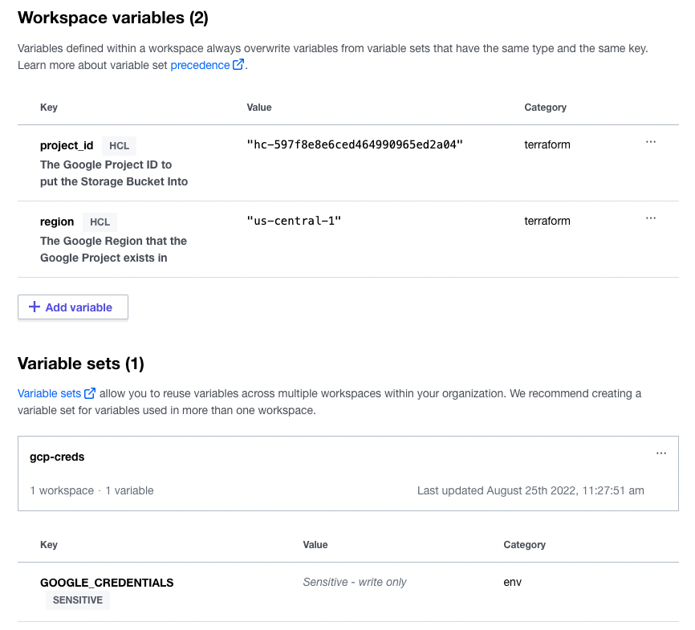

# Terraform Cloud and Enterprise API-driven Workflow Demo - GCP
Terraform Cloud and Enterprise have 3 types of runs that you can choose from when createing a Worksapce. This demo focuses on using an API-driven workspace to deploy a Google Storage Bucket. API-driven workspaces are useful for integrating into existing pipelines.

>Note: The scripts used here are not for production use and have no error handling.

## Create a Workspace and Define the Paramaters of the API Driven Run
1. Create a workspace of the API workflow type
2. Ensure your Google credentials are set for the workspace. See here: https://support.hashicorp.com/hc/en-us/articles/4406586874387-How-to-set-up-Google-Cloud-GCP-credentials-in-Terraform-Cloud
3. Create 2 variables called `project_id` and `region`, and populate their values with an existing project ID and the Google Region.


4. Get an user or team API token with the permissions to perform runs in that workspace
5. Set the token as a `$TOKEN` environment variable in your terminal, or wherever this script will run from.
```bash
export TOKEN=1234.atlasv1.abcdefghijk
```
6. Run the code `api-workspace-push.sh` passing in the terraform directory, organization, and workspace.
```bash
api-workspace-push.sh ./terraform-code <organization>/<workspace>
```
>Note: The token must have permissions to perform Terraform Runs on the Workspace.

7. You should see a run begin in the workspace.

## The Script
An overview of the steps in the `api-workspace-push.sh` script.
### Step 1. Define Variables
The script will define the organization, workspace, and terraform code directory for the script.
### Step 2: Package the Terraform Code for Upload
The configuration version API requires a tar.gz file to use the configuration version for a run, so you must package the directory containing the Terraform configuration into a tar.gz file.

```bash
HCLUPLOAD_FILE_NAME="./content-$(date +%s).tar.gz"
```
```bash
tar -zcvf "$UPLOAD_FILE_NAME" -C "$CONTENT_DIRECTORY"
```

### Step 3: Get the Workspace ID for the API Run
The first step identified the organization name and the workspace name; however, the configuration version API expects the workspace ID. As such, the ID has to be looked up. If the workspace ID is already known, this step can be skipped. This step uses the jq tool to parse the JSON output and extract the ID value into the WORKSPACE_ID variable.

```bash
WORKSPACE_ID=($(curl \
  --header "Authorization: Bearer $TOKEN" \
  --header "Content-Type: application/vnd.api+json" \
  https://app.terraform.io/api/v2/organizations/$ORG_NAME/workspaces/$WORKSPACE_NAME \
  | jq -r '.data.id'))
```

### Step 4: Create a Config Version
Before uploading the configuration files, you must create a configuration-version to associate uploaded content with the workspace. This API call performs two tasks: it creates the new configuration version and it extracts the upload URL to be used in the next step.

```bash
echo '{"data":{"type":"configuration-versions"}}' > ./create_config_version.json

UPLOAD_URL=($(curl \
  --header "Authorization: Bearer $TOKEN" \
  --header "Content-Type: application/vnd.api+json" \
  --request POST \
  --data @create_config_version.json \
  https://app.terraform.io/api/v2/workspaces/$WORKSPACE_ID/configuration-versions \
  | jq -r '.data.attributes."upload-url"'))
```

### Step 5: Upload the Configuration Content File
Next, upload the configuration version tar.gz file to the upload URL extracted from the previous step. If a file is not uploaded, the configuration version will not be usable, since it will have no Terraform configuration files.

Terraform Cloud automatically creates a new run with a plan once the new file is uploaded. If the workspace is configured to auto-apply, it will also apply if the plan succeeds; otherwise, an apply can be triggered via the Run Apply API. If the API token used for the upload lacks permission to apply runs for the workspace, the run can't be auto-applied. (More about permissions.)

```bash
curl \
  --header "Content-Type: application/octet-stream" \
  --request PUT \
  --data-binary @"$UPLOAD_FILE_NAME" \
  $UPLOAD_URL
```

### Step 6: Delete Temporary Files
In the previous steps a few files were created; they are no longer needed, so they should be deleted.

```bash
rm "$UPLOAD_FILE_NAME"
rm ./create_config_version.json
```